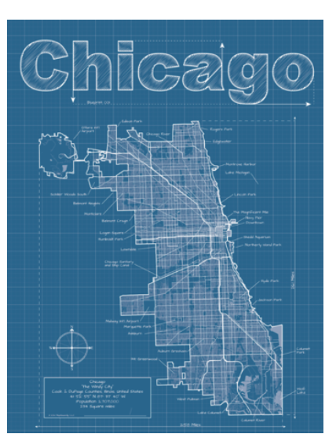
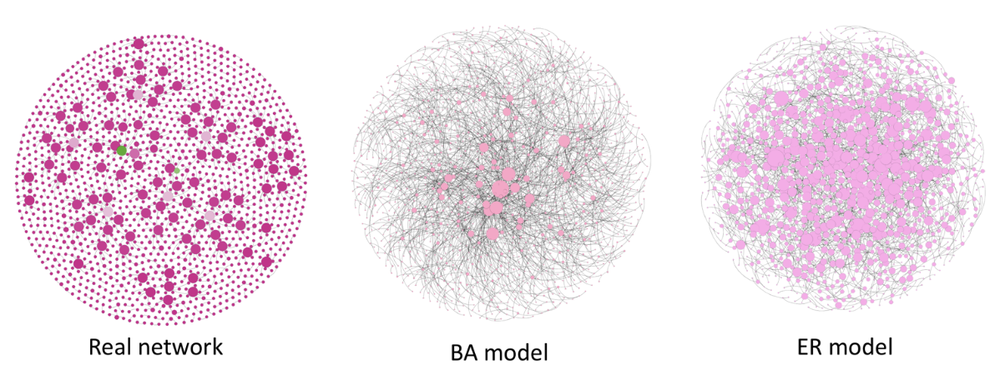
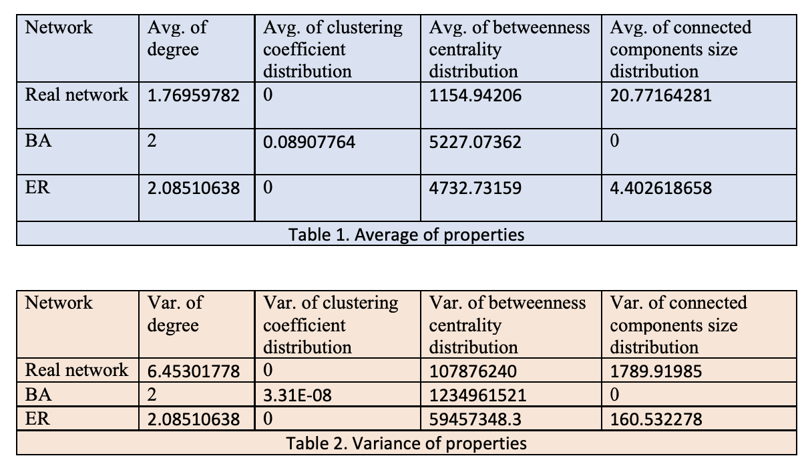
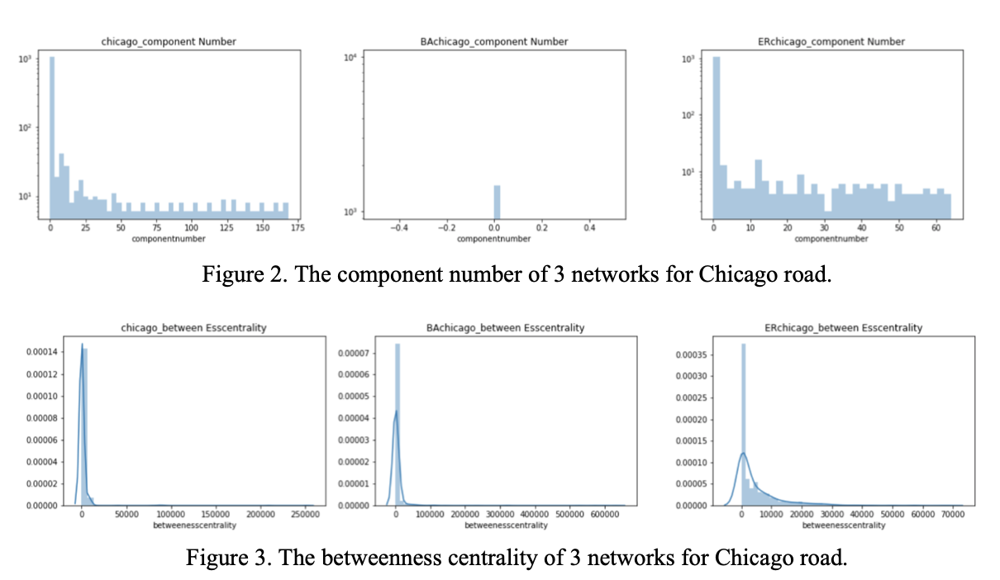
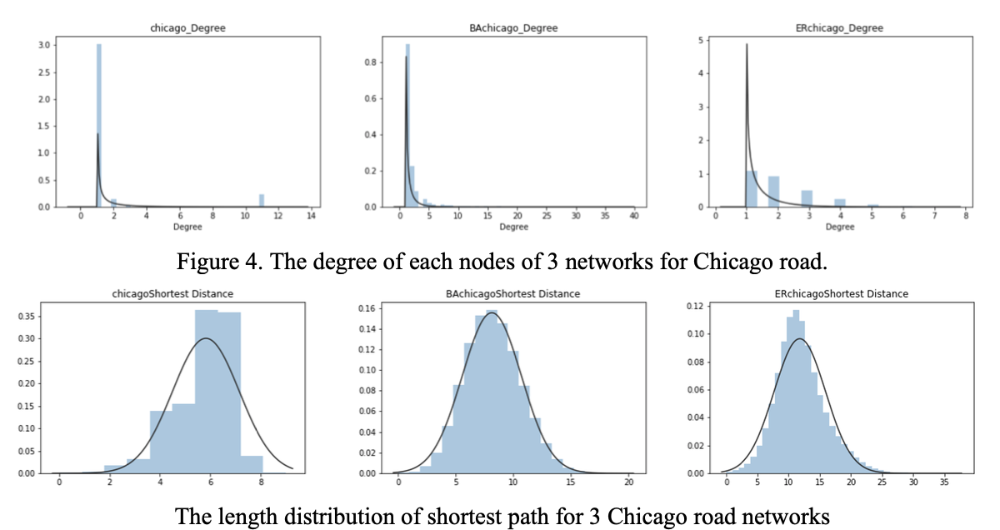
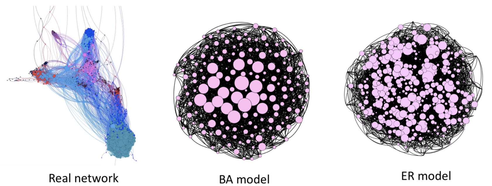
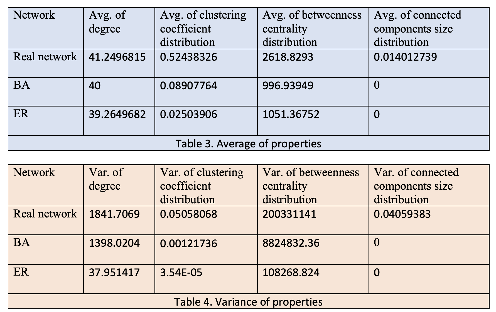
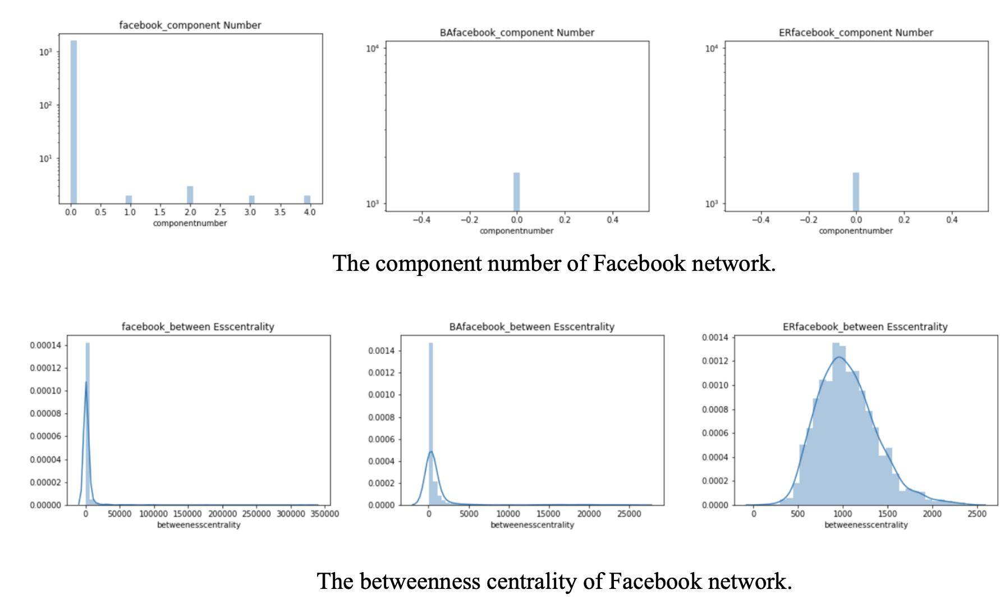
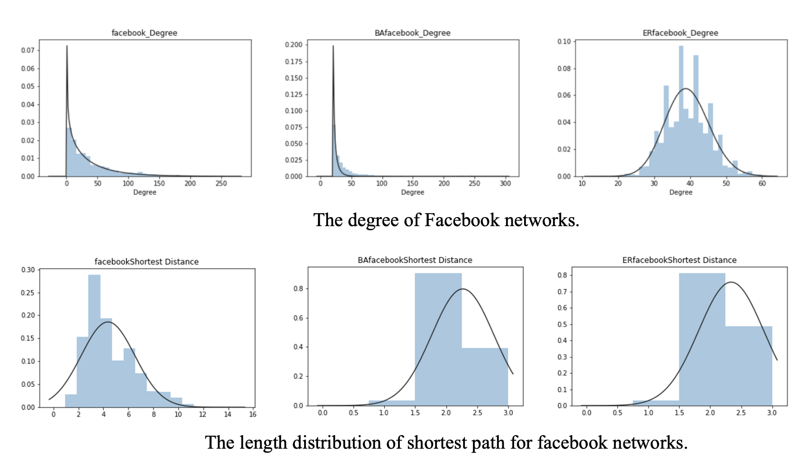

### Road network of Chicago region
This is the road transportation network of the Chicago region (USA). Nodes are transportation nodes (1,467 vertices), and edges are connections (1,298 edges). The data source is from the website which was updating by astabler on GitHub. The link is here www.bgu.ac.il/~bargera/tntp/. They collected multiple transportation networks including Anaheim Network, Barcelona Network, Austin Network, Chicago network, and more. I downloaded the TSV file from KONECT. This database was created by KONECT, in April 2017. All edges are undirected, and edges are unweighted. Study these transportation networks can help people solve the most basic problems in transportation research, like traffic assignment problem.

  

Figure 1. Road networks of Chicago region. Here are 3 networks, one is the real network, data collected from Chicago region, the other 2 are BA model and ER model network. BA model based on the minimum degree of the real network. When I was doing this, I process the real network in the Gephi software first, then can get the minimum degree and the node number. Then I used the code Professor Szymanski provided on the class to get 2 txt file contains edges of nodes. The ER network based on the average degree of the nodes in the real network, then we can get the similar number of nodes. Node size are ranking based the degree of each node. But I did not control the minimum and the maximum node size are the same in the 3 networks. That is the part I can improve. And also the edges thickness I also need to control them to make the comparison clearer. Layout was Fruchterman Reingold. The gravity is 20.0, area is 10000.0, and the speed is 1.0. I used the statistics functions in the Gephi. They are average degree, network diameter, connected components, average clustering coefficient, and average path length. The length distribution of shortest paths I cannot find in Gephi. But the embedded function for NetworkX was easy to be found via google. So for this part I used NetworkX to get the length of shortest paths. Please see the attachment. Following is the average of the degree, the length distribution of the shortest paths, the clustering coefficient distribution, the betweenness centrality distribution and the connected components size distribution. See table 1, it contains these average data for real network,BA and ER model. Table 2. It contains the variances of each set of data for real network, BA and ER model.
  

  

  

  

  

  
For the Chicago road, the most important nodes are the nodes who have the highest degree numbers. Which means that is the main node can connect multiple roads. Which is a cross. And also if the node always on the shortest path that also means it is an important point. The betweenness centrality high node is another important node. This is a scale free network.

  

  
  ### Facebook social circles
The dataset consists of ‘circles’ (‘friends lists’) from Facebook. Facebook data was collected from survey participants using the Facebook app. Facebook data has been anonymized by replacing the facebook ids for each user with a value. Because this dataset is giant for my computer, I deleted some notes and edges. Finally, the final version of the network contains 1,570 nodes and 64,920 edges. Compared with the previous 2 cases, I found the social networks has way more connections between people. I think this is why the website like Facebook called social networks, because the purpose of people having these websites’ account is to make connections. From their description, I know the edges are unweighted and undirected, so I did not consider the in- and out- degrees.

   
Figure 3. Facebook social circle. Here are 3 networks, one is the real network, data collected from the Facebook App, the other 2 are BA model and ER model network. BA model based on the minimum degree of the real network. When I was doing this, I process the real network in the Gephi software first, then can get the minimum degree and the node number. Then I used the code Professor Szymanski provided on the class to get 2 txt file contains edges of nodes. The ER network based on the average degree of the nodes in the real network, then we can get the similar number of nodes. Node size are ranking based the degree of each node. But I did not control the minimum and the maximum node size are the same in the 3 networks. That is the part I can improve. And also the edges thickness I also need to control them to make the comparison clearer. Layout was ForceAtlas2. The tolerance (speed) is 1.0, the approximation is 1.2, the gravity is 1.0, and the scaling is 2.0. I filted the network using node degree. I used the statistics functions in the Gephi. They are average degree, network diameter, connected components, average clustering coefficient, and average path length. The length distribution of shortest paths I cannot find in Gephi. But the embedded function for NetworkX was easy to be found via google. So for this part I used NetworkX to get the length of shortest paths. Please see the attachment. Following is the average of the degree, the length distribution of the shortest paths, the clustering coefficient distribution, the betweenness centrality distribution and the connected components size distribution. See table 5, it contains these average data for real network, BA and ER model. Table 6. It contains the variances of each set of data for real network, BA and ER model.

 

 

Discussion:
For the facebook networks, the most important nodes are the nodes who have the highest degree numbers. Which is a cross. And also if the node always on the shortest path that also means it is an important point. The betweenness centrality high node is another important node. This is a scale free network.
Other:
I used Python for global network properties calculation. The node vice properties are exported from Gephi into .csv files. Additionally, the shorted path is calculated using Python networkX package. Then I used Python Pandas to read the .csv files into the DataFrame for mean and variance calculations. The corresponding histograms are plotted using the Matplotlib package and histogram fitting is done using Scipy stat package. All the code is included in the Jupyter notebook file.

  
